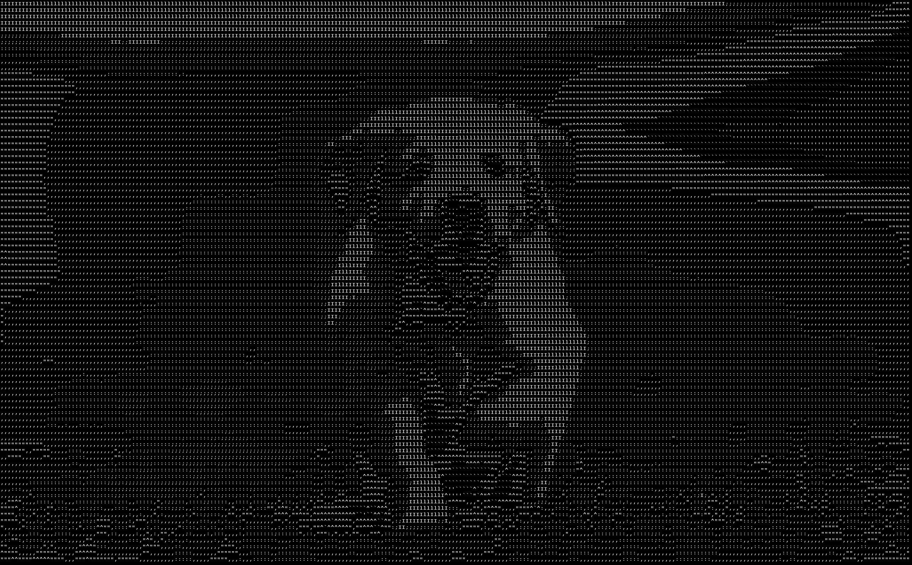
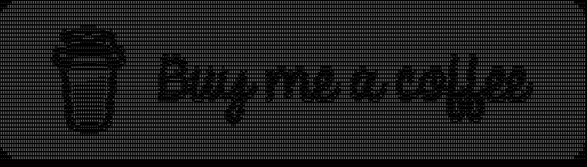

# ArtsKey   by BoyWhileCoding

ArtsKey: Easiest Image to ASCII Conversion Software

Artskey Converts images to ASCII art very accurately, the length of ASCII charaters in each line is given by the user as 'Image Clearance Level' which includes 5 levels i.e, [128,256,512,1024,2048]. For Live Image to ASCII Conversion(GUI) there is additional level '0.765625' i.e, [98]. For Live Image to ASCII Conversion(CLI) the level is automatically generated according to the number of columns of console
#
ArtsKey is programmed in [python](https://www.python.org).

As the image shows, there are 5 available commands:

<table>
  <tr>
    <th>Command</th>
    <td>Usage</td>
  </tr>
  <tr>
    <th>gui</th>
    <td>Starts the Graphical User Interface for ASCII Conversion</td>
  </tr>
  <tr>
    <th>convert(or cvt)</th>
    <td>Starts Command Line Session for ASCII Conversion</td>
  </tr>
  <tr>
    <th>live convert, camera(or cam)</th>
    <td>Starts live ASCII to image convertion, shows it in the Command Prompt (Using camera)</td>
  </tr>
  <tr>
    <th>quit, exit, off(or bye)</th>
    <td>Exits the Application</td>
  </tr>
  <tr>
    <th>example(or ex)</th>
    <td>Converts Example Image into ASCII art</td>
  </tr>
</table>

By Entering 'GUI', a new window pops up

This is a custom tabbed window.
Now as you can there is a big black rectangle, followed by some text and buttons.

Now, we type 'example' in the 'Path to Image' entry as directed in the status box and click 'Select'. A notification comes saying

Now, we click 'Ok' followed by 'Done'.

This time a photo pops up into the black box, which is the example image, and the Image Path entry changes to {The path to ArtsKey.exe}/files/example_input.png which is generated by the program.
As the default Image Clearance Level is already set to 2, we'll leave it as it is and click 'Generate'.

After a few moments the Image Path entry is empty and the statusbox says 'Done', which depicts that the Conversion is sucessful

Now, we open {The path to ArtsKey.exe}/files/results/, there is a new file named 'example_ascii_art_level_2.png'

When we click the second Tab 'ArtsKey Camera', the the contents changes, a bigger black box appears with the level options.
This box contains live converted ASCII art. The level '0.765625' shows the Image-less conversion at 98px/line, because there is no image process involved, the conversion is ~90% faster than other levels.

The Third and the lase tab, with title "Created By BoyWhileCoding" displays the release notes and my BMC and Github links

CLI: The second command in CLI is 'convert', which Takes 'Path to image', 'Image Clearance Level' and choice to create ASCII Image or the ASCII HTML page.
When the conversion is complete, we get '[Debug]> Done' as debug, the result image and HTML page is stored in {The path to ArtsKey.exe}/files/results/.

[image.tests.html result](./files/results/image.tests_ascii_art_level_2.html)

CLI: The Third command in CLI is 'live convert'(or convert live) or 'camera'. It starts a command line camera session.

We get a Note, saying to press ctrl+c to end the camera session.

After a few seconds the art shows up, updates at ~16fps.
Result: Constantly captures pictures from the user's camera, then convert it into ASCII art, and displays it into the command prompt(Image-less).

The moment we click ctrl+c, the image disappears, we get '[Debug]> Session ended' as debug.

CLI: The fifth command converts example image to ASCII art, to the levels given by user.

CLI: The fourth command exits the program

Releases:
[Version 1.4.0'1.0.0]()
